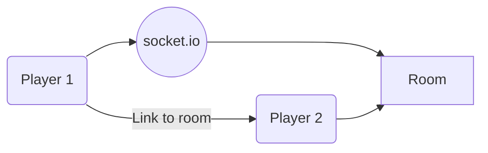

# Chesscape

Chesscape is a online multiplayer chess game. You can create/share a room and play chess with your friends online.

> Backend is built using NodeJS and Socket.io for socket connections
> [Github Repo](https://github.com/the-khalid/Chesscape-backend)

> Frontend is built using React and deployed to vercel
> [Github Repo](https://github.com/the-khalid/chesscape-frontend)
> 

